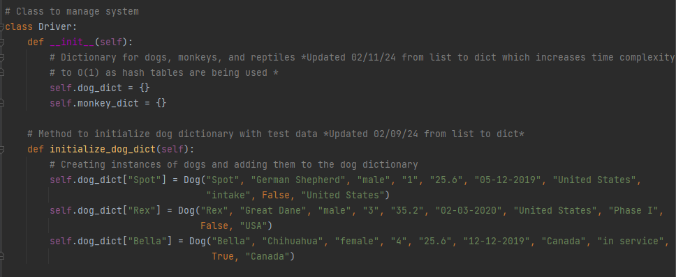

# Welcome!
This ePorfolio demonstrates knowledge and skills in computer science from my schooling at Southern New Hampshire University by improving and enhancing older projects done within my program.

____________________________________________________________________________

### Table of Contents
1. Professional Self Assessment
2. Code Review
3. Software Design and Engineering Enhancement
5. Algorithms and Data Structure Enhancement
7. Databases Enhancement
   
____________________________________________________________________________

### Professional Self Assessment
I have been in the computer science program at Southern New Hampshire University since 2021 shortly after graduating high school. This journey has been transformative in the way I perceive technology and has equipped me with a comprehensive understanding of data structures, algorithms, software engineering, database management, and security. From the enhancements made to the projects within this digital portfolio to projects like the CS-330 Computer Graphics and Visualization, my strengths with these skills have been demonstrated. Other classes in the program have also introduced me to collaborating in a team environment and how to effectively communicate with stakeholders which are important skills in the computer science field and something I previously lacked. The projects in this ePortfolio have shown me just how much I have learned in the course of the program, things like transferring coding languages, working with MySQL, and enhancing time complexity are just some of the skills. Working through these courses and projects has allowed me to gain a deeper understanding of computer science and has improved my employability in the field as my skills set me apart from others. The two artifacts in this ePortfolio, the IT 145: Foundation in Application Development final project and the DAD 220: Introduction to SQL final project, will reflect my growth throughout this course and will demonstrate the full range of my computer science abilities.

____________________________________________________________________________

### Code Review
Code review is an important aspect of developing software as it finds errors, improves code quality, and shares knowledge with other team members. Creating a code review for my artifacts effectively helped me find what I needed to work on and allowed me to enhance my code in many aspects. As my code review is too big to be uploaded to GitHub Pages I have included a link below.

[Link to Code Review](https://youtu.be/TTnRWUtUdeI?si=d8-RxAyysjD_SMZ0)

**Outcome Met:**
I have designed, developed, and delivered professional-quality oral, written, and visual communications that are coherent, technically sound, and appropriately adapted to specific audiences and contexts through my code review.

I have also employed strategies for building collaborative environments that enable diverse audiences to support organizational decision-making in the field of computer science through my code review.

____________________________________________________________________________

### Software Design and Engineering Enhancement
The artifact I chose for this category of enhancement is the IT 145: Foundation in Application Development project. This artifact is a Java program for rescue animals that allows users to add animal information to the system, show the animals in the system, and set them as reserved if needed. The artifact is used for dogs and monkeys as of right now and gathers information like name, animal type, training status, and in-service country. The original code was made with Java, had insufficient commenting, and had issues functioning as it had improper syntax and spelling of variables.

[Link to IT 145 Original Project](/IT_145_Original_Artifact_Abiel_Zamora.zip)

[Link to IT 145 Enhanced Project](/CS-499_Enhancement_One_Abiel_Zamora.zip)

**List of enhancements made:**

1. Transferred language from Java to Python.
2. Improved syntax in the “reserveAnimal” method, “printAnimal” methods, and “RescueAnimal” class.
3. Corrected Indentation throughout the entire code.
4. Included comments with intent and decision of the functionality throughout the code.
5. Removed leftover or commented-out code.
6. Corrected Spelling of variables like the "InServiceCountry" variable.
7. Included Error Handling in areas where user input isn't accepted.

**Outcome Met:**

I have demonstrated an ability to use well-founded and innovative techniques, skills, and tools in computing practices for the purpose of implementing computer solutions that deliver value and accomplish industry-specific goals by completing the following enhancements.

I also employed strategies for building collaborative environments that enable diverse audiences to support organizational decision-making in the field of computer science by completing the following enhancements

**Narrative:**

The decision to include this artifact within my ePortfolio was made easy as this work can show many programming skills and abilities while not being overly complex to understand. The use of classes and inheritance in my code shows skills and understanding in object-oriented design. My ability to work with collections in Java is shown by my use of Array Lists. The use of a “Scanner” object shows my knowledge of user input and handling. Code readability is apparent in the entirety of my code as it's organized with classes and methods. All of these skills I have used show an understanding of software development. I have met the outcome of showcasing the ability to innovative techniques, skills, and tools in this code by transferring the language from Java to Python and enhancing the overall logic in many areas like the “reserveAnimal” method, “printAnimal” methods, and “RescueAnimal” class. The syntax in these areas were also improved. I have ensured the code has correct indentation, comments, and follows proper coding standards. Leftover and commented-out code was removed and the variables in the code were corrected for spelling and usage like static or instance. Error handling was included in the code as well. All of this was done to improve the overall readability, maintainability, and functionality while showcasing my skills in software development as mentioned in my Code Review. Throughout the process of these enhancements, I also met the outcome of using strategies for building collaborative environments so that audiences support decision-making by adding in informational comments which allow collaboration and my own collaborative efforts made with my professor to ensure decision-making was sufficient in my enhancements. The process of enhancing the artifact allowed me to realize the amount of coding skills I have learned since making this artifact in 2021 as I could instantly see some of the errors within it. I was able to fix many of the mistakes and areas of improvement with my current knowledge in Java programming; yet for some aspects regarding the logic I had no choice but to do research. Websites like "Stack Overflow” allowed me to see how others tackled similar issues and how they were able to fix them. Using that information and altering it for my case usage I was able to successfully fix some of the challenges in the code. With these enhancements, I have shown my ability to use innovative skills and techniques for implementing design solutions and accomplishing my goals by transferring the language and improving the syntax, indentation, and overall readability.

____________________________________________________________________________

### Algorithms and Data Structure Enhancement
The artifact for the Algorithms and Data Structure category is the IT 145: Foundation in Application Development project described above. Originally the algorithmic logic, time complexity, and practices were flawed in this project.

[Link To IT 145 Original Project](IT_145_Original_Artifact_Abiel_Zamora.zip)

[Link to IT 145 Enhanced Project](CS-499_Enhancement_Two_Abiel_Zamora.zip)

**List of enhancements made:**

1. Replaced list functionality with dictionary functionality.
2. Improved time complexity of adding, storing, and reserving new animals from O(n) to O(1).
3. Included input validation through the driver class.
4. Improved overall code by using best standard practices.
5. Improved efficiency with corrected print statements.

   
**Outcome Met:**

I have designed and evaluated computing solutions that solve a given problem using algorithmic principles and computer science practices and standards appropriate to its solution while managing the trade-offs involved in design choices by completing the following enhancements.

**Narrative:**

The decision to include this artifact within my ePortfolio was due to its ability to show my many programming skills and abilities. Many components of the artifact showcase my abilities in algorithms and data structure. For example, my replacement of lists for dictionaries in the code shows skills in improving time complexity as it optimized the operations in the system and resulted in increased data management. The use of input validation in the “reserve” method demonstrates knowledge in implementing algorithmic logic and making the system more efficient as it prevents errors from forming in the system from incorrect information. By using object initialization in the code instead of combining everything under one Python file, ensures better data management, maintainability, readability, and overall shows an understanding of data structure optimization. The artifact was improved by adding dictionary functions that use hash tables to optimize the system and time complexity. Another improvement was the addition of input validation in the system to handle any invalid inputs as without it errors could occur and lead to bigger problems that reduce the efficiency of the code. With this enhancement, I demonstrated skills in optimization, data management, and enhancing time complexity. This was done with my addition of dictionaries, input validation, and other enhancements. This enhancement focused on algorithmic principles and data structures to ensure efficiency at the cost of affecting some code readability within the project. Specifically, I improved the time complexity and optimization of adding, storing, and reserving new animals from O(n) to O(1) just by switching over from the list functionality to the dictionary functionality as it uses hash tables which allows the system to do quick searches. I have met the outcome of designing computing solutions that solve a problem using algorithmic principles and computer science standards appropriate to its solution while managing the trade-offs. I used algorithmic principles throughout the design of my code with my data structures such as the dictionaries and algorithms in the feature of managing the dogs and monkeys to enhance the project and solve issues like bad time complexity and optimization. Best standard practices were used throughout my work as I ensured everything was readable, maintainable, and consistent. Furthermore, I made sure to manage tradeoffs as previously mentioned by assessing what features may be negatively impacted by improving optimization like the code readability being worse than before by the implementation of input validations and more. The process of enhancing the artifact allowed me to realize the amount of coding skills I have learned since making this artifact in 2021 as I could instantly see some of the errors within it. I was able to fix many of the mistakes and areas of improvement with my current knowledge in Python programming; yet some aspects regarding the adding the implementation of HashMap I had no choice but to do research. Websites like "Stack Overflow” allowed me to see how others tackled similar issues and how they were able to fix them. Using that information and altering it for my case usage I was able to successfully fix some of the challenges in the code. 

____________________________________________________________________________

### Databases Enhancement
The artifact for the databases category is the DAD 220: Introduction to SQL project made sometime around 2022. It is a database that stores customer, order, and return information to allow a user to query or store data with it. This database is made with MySQL and is the first project I have made with this application. 

[Link To DAD 220 Original Project](DAD_220_Original_Artifact_Abiel_Zamora.zip)

[Link to DAD 220 Enhanced Project](CS-499_Enhancement_Three_Abiel_Zamora.zip)

**List of enhancements made:**
1. Included indexes.
2. Included triggers.
3. Removed duplicated or unused tables.
4. Included encryption of customer information.

**Outcome Met:**

I developed a security mindset that anticipates adversarial exploits in software architecture and designs to expose potential vulnerabilities, mitigate design flaws, and ensure privacy and enhanced security of data and resources by completing the following enhancements. 

I also demonstrated an ability to use well-founded and innovative techniques, skills, and tools in computing practices for the purpose of implementing computer solutions that deliver value and accomplish industry-specific goals by completing the following enhancements.

**Narrative:**

This artifact shows a wide range of skills with databases and will allow others to get an idea of my knowledge. I chose this artifact as it was a great way to showcase my skills with my planned enhancements as when it was first made it had many flaws and was very simple. Many components of this database showcase my skills such as my knowledge of database design which is apparent in my creation of the tables of customers, orders, and returns in the database. Skills in MySQL and querying are apparent as many of those skills are used within the database to get any needed information like the select statements used. Moreover, indexing and triggers in the work show an understanding of database optimization and automation within the system. The indexing is in the customers, orders, and returns tables which allows for users to easily find information based on specific data like last name, state, and order ID. The triggers are apparent in the customers and orders table and allow for the database to automatically store the time an update was made to an order or customer. Furthermore, the encrypted street address for the Customers table shows an understanding of security implementation within databases. I also cleaned up the database by removing tables that were not being used, removing duplicated tables, and changing the names of tables to make more sense with the database. The artifact was improved by the implementation of indexes, triggers, and encryption. These advanced concepts of SQL enhanced the overall efficiency of the database and allowed for a more secure environment. With these enhancements, I implemented more advanced concepts of SQL into my database with indexes, triggers, and encryption. I also met the outline of demonstrating the ability to use techniques or skills to deliver solutions of value and the outline of developing a security mindset with my enhancements to the database. I met these outlines as I demonstrated my skills with advanced SQL concepts like indexing in multiple tables for improved efficiency with the ability to quickly search based on the criteria. The outline was also met with the triggers for the orders and customers table to have automatic functionality with the timestamps. Finally, the outline was further met with the security aspect of including encryption within the customer information to ensure there is no unauthorized access and improve the overall security of the database. While enhancing this database I learned that SQL has many advanced concepts I didn’t know. I faced many challenges with not being able to add as many triggers as I would like due to the database version not allowing more than one trigger per table. This meant searching on Stack Overflow for long periods of time trying to find a way with no solution. I have accepted the triggers implemented in the tables as of right now and am going to try to create a more advanced trigger for the returns table for my ePortfolio. 
